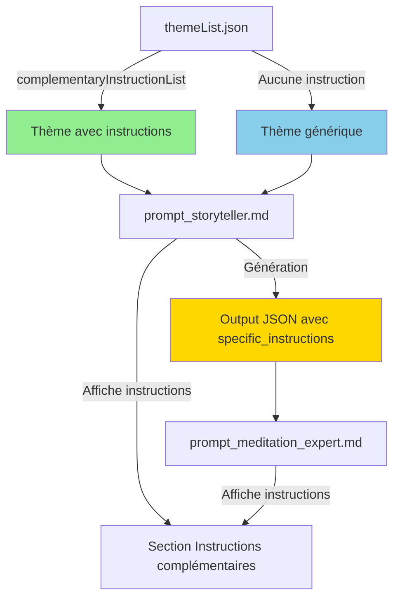

# Instructions Complémentaires par Thème - Documentation Technique

## 📋 Table des matières

1. [Contexte et problématique](#contexte-et-problématique)
2. [Contraintes et exigences](#contraintes-et-exigences)
3. [Solution architecture](#solution-architecture)
4. [Structure de données](#structure-de-données)
5. [Exemples concrets](#exemples-concrets)
6. [Intégration dans les prompts](#intégration-dans-les-prompts)
7. [Principes de conception](#principes-de-conception)
8. [Guide d'implémentation](#guide-dimplémentation)

---

## Contexte et problématique

### Système actuel

Le système de génération de méditations guidées fonctionne avec :
- **Plus de 20 thèmes différents** stockés dans [`data/themeList.json`](../data/themeList.json:1)
- **Deux prompts successifs** pour générer une méditation complète :
  1. [`prompt_storyteller.md`](../prompt_storyteller.md:1) - Crée le récit narratif (5 scènes)
  2. [`prompt_meditation_expert.md`](../prompt_meditation_expert.md:1) - Transforme le récit en méditation guidée

### Problème identifié

Certains thèmes nécessitent des **instructions spécifiques** pour améliorer la qualité narrative :

**Exemple concret - Thème Pokémon :**
- ❌ **Problème** : Le prompt génère des descriptions génériques ("créatures magiques", "petites bêtes")
- ✅ **Besoin** : Utiliser des noms de Pokémon spécifiques (Pikachu, Mew, Évoli, etc.)
- ⚠️ **Contrainte** : Laisser le prompt choisir les Pokémon adaptés au contexte narratif

### Ce qu'on NE veut PAS

```json
// ❌ MAUVAISE APPROCHE : Fixer les noms en base de données
{
  "theme": "Pokémon",
  "specificPokemons": ["Pikachu", "Mew", "Évoli"]  // Trop rigide, toujours les mêmes
}
```

```markdown
// ❌ MAUVAISE APPROCHE : Donner des exemples fixes
"Dans la forêt, tu aperçois Pikachu qui joue près d'un ruisseau"
// Risque : Ces exemples seront répétés systématiquement
```

### Ce qu'on VEUT

```json
// ✅ BONNE APPROCHE : Instructions génériques pour favoriser la créativité
{
  "title": "Noms de Pokémon",
  "instruction": "Inclus des noms de Pokemon connus"
}
// Le prompt IA choisit les Pokémon pertinents selon le contexte narratif
```

---

## Contraintes et exigences

### Exigences fonctionnelles

1. **Réutilisabilité totale**
   - Les instructions doivent être utilisables dans TOUS les prompts
   - Actuellement : `prompt_storyteller.md` et `prompt_meditation_expert.md`
   - Futurs prompts : doivent pouvoir accéder aux mêmes instructions

2. **Spécificité par thème**
   - Les instructions ne s'appliquent QU'au thème concerné
   - Exemple : instructions Pokémon ≠ instructions Harry Potter ≠ instructions The Last of Us

3. **Modularité**
   - Tous les thèmes n'ont pas besoin d'instructions spécifiques
   - Les thèmes sans instructions doivent fonctionner normalement

4. **Créativité préservée**
   - Les instructions sont des directives, pas des contenus fixes
   - Le prompt IA garde son autonomie créative
   - Pas d'exemples qui seraient répétés systématiquement

### Contraintes techniques

- **20+ thèmes** dans [`themeList.json`](../data/themeList.json:1)
- **Structure JSON** existante à préserver
- **Compatibilité** avec le système de templates (Handlebars)
- **Maintenabilité** : facile à étendre pour de nouveaux thèmes

---

## Solution architecture

### Vue d'ensemble



### Flux de données

1. **Entrée** : Thème sélectionné depuis [`themeList.json`](../data/themeList.json:1)
2. **Prompt 1** : [`prompt_storyteller.md`](../prompt_storyteller.md:1) reçoit les `complementaryInstructionList`
3. **Génération** : Le Storyteller crée le récit en suivant les instructions
4. **Output** : JSON avec section `specific_instructions` (metadata du récit)
5. **Prompt 2** : [`prompt_meditation_expert.md`](../prompt_meditation_expert.md:1) reçoit le tout
6. **Résultat** : Méditation guidée cohérente avec les instructions du thème

---

## Structure de données

### Structure dans themeList.json

#### Thème AVEC instructions complémentaires

```json
{
  "theme": "Pokémon",
  "universe": "Un monde où les humains coexistent avec des créatures aux pouvoirs extraordinaires, les Pokémon. Les dresseurs voyagent, capturent, entraînent et combattent aux côtés de leurs Pokémon pour devenir les meilleurs.",
  "vocabulary": [
    "Dresseur",
    "Pokémon",
    "Poké Ball",
    "Attaque",
    "Capture",
    "Évolution",
    "Arène",
    "Légendaire"
  ],
  "complementaryInstructionList": [
    {
      "title": "Noms de Pokémon",
      "instruction": "Inclus des noms de Pokemon connus",
      "metadata": {
        "pokemonNames": "Noms de Pokémon adaptés au contexte narratif"
      }
    }
  ]
}
```

**Champs expliqués :**

| Champ | Type | Description | Exemple |
|-------|------|-------------|---------|
| `title` | string | Titre de l'instruction (pour documentation) | "Noms de Pokémon" |
| `instruction` | string | Directive pour le prompt IA | "Inclus des noms de Pokemon connus" |
| `metadata` | object | Structure de sortie attendue | `{"pokemonNames": "..."}` |

#### Thème SANS instructions complémentaires

```json
{
  "theme": "Philosophie",
  "universe": "L'univers philosophique explore les questions fondamentales de l'existence, de la connaissance, des valeurs, de la raison, de l'esprit et du langage.",
  "vocabulary": [
    "Métaphysique",
    "Épistémologie",
    "Éthique",
    "Logique",
    "Esthétique",
    "Ontologie",
    "Phénoménologie",
    "Existentialisme"
  ]
  // Pas de complementaryInstructionList : fonctionne avec les instructions générales
}
```

### Structure de l'output du Storyteller

```json
{
  "version": "1.0",
  "storyteller_output": {
    "theme": {
      "theme": "Pokémon",
      "theme_description": "Un monde où les humains coexistent...",
      "example_theme_vocabulary": ["Dresseur", "Pokémon", "Poké Ball"],
      "specific_instructions": {
        "pokemonNames": "Pikachu, Mew, Évoli - Pokémon paisibles adaptés à l'ambiance méditative de la forêt"
      },
      "sensory_elements": {
        "visual": "Éléments visuels...",
        "auditory": "Sons...",
        "tactile": "Sensations..."
      }
    },
    "narrative": {
      "scenes": [...]
    }
  }
}
```

**Note importante** : La clé `specific_instructions` contient les **résultats** de l'application des instructions, pas les instructions elles-mêmes.

---

## Exemples concrets

### Exemple 1 : Thème Pokémon

**Configuration dans themeList.json :**

```json
{
  "theme": "Pokémon",
  "universe": "Un monde où les humains coexistent avec des créatures aux pouvoirs extraordinaires, les Pokémon.",
  "vocabulary": ["Dresseur", "Pokémon", "Poké Ball", "Évolution", "Légendaire"],
  "complementaryInstructionList": [
    {
      "title": "Noms de Pokémon",
      "instruction": "Inclus des noms de Pokemon connus",
      "metadata": {
        "pokemonNames": "Noms de Pokémon adaptés au contexte narratif"
      }
    }
  ]
}
```

**Ce que le prompt voit :**

```markdown
### Thème de la méditation
- **Thème** : Pokémon
- **Description de l'univers** : Un monde où les humains coexistent avec des créatures aux pouvoirs extraordinaires, les Pokémon.
- **Vocabulaire thématique disponible** : Dresseur, Pokémon, Poké Ball, Évolution, Légendaire

### Instructions complémentaires pour ce thème
- **Noms de Pokémon** : Inclus des noms de Pokemon connus
```

**Output généré par le Storyteller :**

```json
{
  "theme": {
    "specific_instructions": {
      "pokemonNames": "Pikachu, Mew, Évoli - choisis pour leur nature paisible et leur lien avec la forêt enchantée du récit"
    }
  }
}
```

**Résultat dans le récit (scène 2) :**

```
"narrative_text": "Dans la clairière baignée de lumière douce, un Évoli aux 
grands yeux curieux s'approche lentement. Ses pattes font à peine de bruit 
sur l'herbe tendre. Plus loin, un Pikachu repose sur une branche basse, 
ses joues émettant une lueur dorée apaisante. L'air sent les fleurs et 
la rosée du matin..."
```

### Exemple 2 : Thème Harry Potter

**Configuration dans themeList.json :**

```json
{
  "theme": "Harry Potter",
  "universe": "Un monde de sorciers, de magie, d'aventures et de mystères.",
  "vocabulary": ["Poudlard", "sorcier", "moldus", "sortilège", "baguette magique"],
  "complementaryInstructionList": [
    {
      "title": "Personnages et lieux emblématiques",
      "instruction": "Inclus des noms de personnages (Harry, Hermione, Ron) et de lieux (Poudlard, Chemin de Traverse)",
      "metadata": {
        "characters": "Personnages adaptés au contexte",
        "locations": "Lieux magiques spécifiques"
      }
    },
    {
      "title": "Objets magiques",
      "instruction": "Mentionne des objets magiques spécifiques (Patronus, baguettes, objets enchantés)",
      "metadata": {
        "magicalObjects": "Objets magiques pertinents pour le récit"
      }
    }
  ]
}
```

**Output généré :**

```json
{
  "theme": {
    "specific_instructions": {
      "characters": "Hermione - pour son amour des livres dans la bibliothèque",
      "locations": "Bibliothèque de Poudlard, Salle commune de Gryffondor",
      "magicalObjects": "Livre de sorts lumineux, plume auto-écrivante"
    }
  }
}
```

### Exemple 3 : Thème The Last of Us

**Configuration dans themeList.json :**

```json
{
  "theme": "The Last of Us",
  "universe": "Dans un monde post-apocalyptique ravagé par une pandémie.",
  "vocabulary": ["Cordyceps", "Survivants", "Zone de quarantaine", "Élie", "Joel"],
  "complementaryInstructionList": [
    {
      "title": "Personnages",
      "instruction": "Inclus Joel et Ellie comme figures protectrices",
      "metadata": {
        "characters": "Joel et Ellie dans leur rôle protecteur"
      }
    },
    {
      "title": "Ton méditatif",
      "instruction": "Adapter le ton pour la méditation : focus sur l'espoir et la beauté de la nature qui reprend ses droits, pas sur la violence",
      "metadata": {
        "narrativeTone": "Moments paisibles et contemplatifs de l'univers"
      }
    }
  ]
}
```

**Output généré :**

```json
{
  "theme": {
    "specific_instructions": {
      "characters": "Joel et Ellie au repos dans un refuge sûr",
      "narrativeTone": "Focus sur la nature qui reprend ses droits, la beauté des bâtiments envahis par les plantes, les moments de connexion humaine"
    }
  }
}
```

### Exemple 4 : Thème sans instructions (Philosophie)

**Configuration dans themeList.json :**

```json
{
  "theme": "Philosophie",
  "universe": "L'univers philosophique explore les questions fondamentales de l'existence.",
  "vocabulary": ["Métaphysique", "Épistémologie", "Éthique", "Logique"]
  // Pas de complementaryInstructionList
}
```

**Ce que le prompt voit :**

```markdown
### Thème de la méditation
- **Thème** : Philosophie
- **Description de l'univers** : L'univers philosophique explore les questions fondamentales de l'existence.
- **Vocabulaire thématique disponible** : Métaphysique, Épistémologie, Éthique, Logique

// Pas de section "Instructions complémentaires"
```

**Output généré :**

```json
{
  "theme": {
    "theme": "Philosophie",
    // Pas de specific_instructions
  }
}
```

---

## Intégration dans les prompts

### Modification de prompt_storyteller.md

**Emplacement** : Après la ligne 14 (vocabulaire thématique)

**Code à ajouter :**

```markdown
{{#if $('data').item.json.theme.complementaryInstructionList }}

### Instructions complémentaires pour ce thème

{{#each $('data').item.json.theme.complementaryInstructionList }}
- **{{ this.title }}** : {{ this.instruction }}
{{/each}}
{{/if}}
```

**Contexte complet :**

```markdown
### Thème de la méditation
- **Thème** : {{ $('data').item.json.theme.label }}
- **Description de l'univers** : {{ $('data').item.json.theme.description }}
- **Vocabulaire thématique disponible** : {{ $('data').item.json.theme.vocabulary.join(", ") }}

{{#if $('data').item.json.theme.complementaryInstructionList }}

### Instructions complémentaires pour ce thème

{{#each $('data').item.json.theme.complementaryInstructionList }}
- **{{ this.title }}** : {{ this.instruction }}
{{/each}}
{{/if}}

### Lieu et ambiance de méditation
- **Lieu de méditation** : {{ $('data').item.json.ambiance.immersion.name }}
```

### Modification de prompt_meditation_expert.md

**Même modification exacte** après la ligne 14.

### Modification du format de sortie du Storyteller

**Dans la section JSON output du prompt_storyteller.md**, ajouter dans la section `theme` :

```json
{
  "theme": {
    "theme": "{{ $('data').item.json.theme.label }}",
    "theme_description": "{{ $('data').item.json.theme.description }}",
    "example_theme_vocabulary": ["..."],
    "specific_instructions": {
      "pokemonNames": "Noms de Pokémon adaptés au contexte narratif"
    },
    "sensory_elements": {...}
  }
}
```

**Note** : La section `specific_instructions` doit être générée dynamiquement en fonction des `metadata` de chaque instruction complémentaire.

---

## Principes de conception

### 1. Généricité et réutilisabilité

**Principe** : Les instructions sont stockées une seule fois et utilisables partout.

**Bénéfice** :
- ✅ Modification centralisée dans [`themeList.json`](../data/themeList.json:1)
- ✅ Cohérence garantie entre tous les prompts
- ✅ Facilité de maintenance

**Anti-pattern à éviter** :
```markdown
❌ Dupliquer les instructions dans chaque prompt
❌ Stocker les instructions dans plusieurs fichiers
```

### 2. Créativité préservée

**Principe** : Les instructions guident sans contraindre.

**Approche correcte** :
```json
{
  "instruction": "Inclus des noms de Pokemon connus"
  // ✅ Directive générale, laisse le choix au prompt
}
```

**Approche incorrecte** :
```json
{
  "instruction": "Utilise exactement Pikachu, Mew et Évoli",
  "fixedExamples": ["Pikachu", "Mew", "Évoli"]
  // ❌ Trop contraignant, tue la créativité
}
```

**Résultat souhaité** : Chaque génération produit des Pokémon différents adaptés au contexte narratif.

### 3. Modularité et optionalité

**Principe** : Les instructions sont optionnelles et modulaires.

**Structure modulaire** :
```json
{
  "complementaryInstructionList": [
    {
      "title": "Instruction A",
      "instruction": "..."
    },
    {
      "title": "Instruction B",
      "instruction": "..."
    }
  ]
}
```

**Bénéfices** :
- ✅ Ajouter/retirer des instructions facilement
- ✅ Thèmes sans instructions fonctionnent normalement
- ✅ Évolution progressive du système

### 4. Séparation des responsabilités

**Architecture claire** :

| Composant | Responsabilité |
|-----------|----------------|
| [`themeList.json`](../data/themeList.json:1) | Stockage des données et instructions |
| [`prompt_storyteller.md`](../prompt_storyteller.md:1) | Affichage et application des instructions |
| [`prompt_meditation_expert.md`](../prompt_meditation_expert.md:1) | Utilisation du résultat enrichi |

**Anti-pattern** :
```markdown
❌ Prompt qui modifie les données sources
❌ Base de données qui contient de la logique métier
```

### 5. Évolutivité

**Design extensible** :

```json
// Version actuelle
{
  "complementaryInstructionList": [
    {
      "title": "Noms de Pokémon",
      "instruction": "Inclus des noms de Pokemon connus",
      "metadata": {
        "pokemonNames": "..."
      }
    }
  ]
}

// Évolution future possible
{
  "complementaryInstructionList": [
    {
      "title": "Noms de Pokémon",
      "instruction": "Inclus des noms de Pokemon connus",
      "metadata": {
        "pokemonNames": "..."
      },
      "priority": "high",  // Nouveau champ possible
      "context": ["forest", "mountain"]  // Contextualisation
    }
  ]
}
```

---

## Guide d'implémentation

### Étape 1 : Mise à jour de themeList.json

**Pour les thèmes nécessitant des instructions :**

1. Identifier le thème à enrichir
2. Ajouter le champ `complementaryInstructionList`
3. Définir chaque instruction avec :
   - `title` : nom descriptif
   - `instruction` : directive claire et générique
   - `metadata` : structure de sortie attendue

**Exemple - Ajout pour Star Wars :**

```json
{
  "theme": "Star Wars",
  "universe": "Un univers de science-fiction épique où la Force...",
  "vocabulary": ["La Force", "Jedi", "Sith", "Sabre laser"],
  "complementaryInstructionList": [
    {
      "title": "Personnages emblématiques",
      "instruction": "Inclus des personnages iconiques (Jedi, droïdes) adaptés à l'ambiance méditative",
      "metadata": {
        "characters": "Personnages Star Wars dans un contexte paisible"
      }
    },
    {
      "title": "Lieux symboliques",
      "instruction": "Mentionne des lieux reconnaissables (Temple Jedi, Forêt d'Endor) favorisant la sérénité",
      "metadata": {
        "locations": "Lieux Star Wars propices à la méditation"
      }
    }
  ]
}
```

### Étape 2 : Modification des prompts

**Fichiers à modifier :**
- [`prompt_storyteller.md`](../prompt_storyteller.md:14)
- [`prompt_meditation_expert.md`](../prompt_meditation_expert.md:14)

**Ajout après la ligne 14 dans les deux fichiers :**

```markdown
{{#if $('data').item.json.theme.complementaryInstructionList }}

### Instructions complémentaires pour ce thème

{{#each $('data').item.json.theme.complementaryInstructionList }}
- **{{ this.title }}** : {{ this.instruction }}
{{/each}}
{{/if}}
```

### Étape 3 : Mise à jour du format de sortie

**Dans [`prompt_storyteller.md`](../prompt_storyteller.md:157), section `theme` du JSON :**

Ajouter après `example_theme_vocabulary` :

```json
"specific_instructions": {
  "pokemonNames": "Noms de Pokémon adaptés au contexte narratif"
},
```

**Note** : Les clés dans `specific_instructions` doivent correspondre aux clés définies dans `metadata` de chaque instruction.

### Étape 4 : Tests et validation

**Checklist de validation :**

- [ ] Un thème AVEC instructions génère correctement
- [ ] Un thème SANS instructions génère correctement
- [ ] Les instructions apparaissent dans le prompt
- [ ] Le JSON de sortie contient `specific_instructions`
- [ ] Les instructions sont respectées dans le récit
- [ ] La créativité est préservée (résultats variés)
- [ ] Pas d'erreurs de template Handlebars

**Scénarios de test recommandés :**

1. **Test Pokémon** : Vérifier que des Pokémon différents apparaissent à chaque génération
2. **Test Philosophie** : Vérifier qu'un thème sans instructions fonctionne normalement
3. **Test Harry Potter** : Vérifier que plusieurs types d'instructions (personnages + objets) cohabitent
4. **Test cohérence** : Vérifier que les instructions sont cohérentes entre Storyteller et Meditation Expert

---

## FAQ - Questions fréquentes

### Q1 : Pourquoi ne pas mettre les exemples directement dans le JSON ?

**R** : Les exemples fixes seraient répétés systématiquement, tuant la créativité. Les instructions génériques permettent au prompt IA de choisir les éléments adaptés au contexte narratif.

### Q2 : Que se passe-t-il si un thème n'a pas de `complementaryInstructionList` ?

**R** : Le thème fonctionne normalement avec les instructions générales du prompt. La condition `{{#if}}` empêche l'affichage d'une section vide.

### Q3 : Peut-on avoir plusieurs instructions pour un même thème ?

**R** : Oui, c'est d'ailleurs recommandé. Exemple : Harry Potter avec instructions pour personnages + lieux + objets magiques.

### Q4 : Les instructions s'appliquent-elles automatiquement aux futurs prompts ?

**R** : Oui, tant que le nouveau prompt inclut le code d'affichage des instructions (bloc `{{#if}}...{{/if}}`).

### Q5 : Comment modifier une instruction existante ?

**R** : Éditer directement le champ `instruction` dans [`themeList.json`](../data/themeList.json:1). La modification sera immédiatement disponible dans tous les prompts.

---

## Annexes

### Annexe A : Template complet pour nouveau thème

```json
{
  "theme": "NOM_DU_THEME",
  "universe": "Description de l'univers du thème",
  "vocabulary": [
    "Mot1",
    "Mot2",
    "Mot3"
  ],
  "complementaryInstructionList": [
    {
      "title": "Type d'instruction 1",
      "instruction": "Description de l'instruction",
      "metadata": {
        "clé1": "Description de ce qui doit être généré"
      }
    },
    {
      "title": "Type d'instruction 2",
      "instruction": "Autre instruction si nécessaire",
      "metadata": {
        "clé2": "Description de ce qui doit être généré"
      }
    }
  ]
}
```

### Annexe B : Thèmes candidats pour instructions complémentaires

Thèmes qui pourraient bénéficier d'instructions complémentaires :

| Thème | Instructions potentielles |
|-------|--------------------------|
| Marvel | Noms de super-héros spécifiques |
| Star Wars | Personnages et vaisseaux iconiques |
| Disney | Personnages Disney/Pixar célèbres |
| Harry Potter | Personnages, lieux magiques, objets |
| Les Gardiens de la Galaxie | Noms des gardiens (Star-Lord, Groot, Rocket) |
| Narcos | Lieux emblématiques (adapter au ton méditatif) |
| Astérix et Obélix | Personnages (Astérix, Obélix, Idéfix) |

### Annexe C : Bonnes pratiques rédactionnelles

**Pour rédiger une bonne instruction :**

✅ **À FAIRE :**
- Utiliser des verbes d'action : "Inclus", "Mentionne", "Utilise"
- Rester générique et guidant
- Donner le but, pas le contenu exact
- Penser "créativité" et "adaptabilité"

❌ **À ÉVITER :**
- Instructions trop prescriptives ou limitantes
- Exemples qui deviendraient des templates
- Instructions contradictoires avec le thème ou le lieu
- Vocabulaire trop technique ou spécialisé

**Exemples :**

| ✅ Bonne instruction | ❌ Mauvaise instruction |
|---------------------|------------------------|
| "Inclus des noms de Pokémon connus" | "Utilise exactement Pikachu et Mew" |
| "Mentionne des personnages emblématiques" | "Harry doit apparaître dans la scène 2" |
| "Référence des lieux iconiques du thème" | "Commence toujours par Poudlard" |

---

## Conclusion

Cette architecture permet d'ajouter des **instructions complémentaires spécifiques** à certains thèmes tout en :

- ✅ Préservant la **créativité** du système de génération
- ✅ Gardant la **modularité** (thèmes avec/sans instructions)
- ✅ Assurant la **réutilisabilité** dans tous les prompts
- ✅ Facilitant la **maintenance** et l'évolution

La solution repose sur trois piliers :
1. **Structure de données claire** dans [`themeList.json`](../data/themeList.json:1)
2. **Intégration simple** dans les prompts via templates Handlebars
3. **Principes de conception** favorisant la généricité et l'extensibilité

---

**Document version** : 1.0  
**Date de création** : 2025-11-01  
**Dernière mise à jour** : 2025-11-01  
**Auteur** : Documentation technique - Système de méditations guidées
