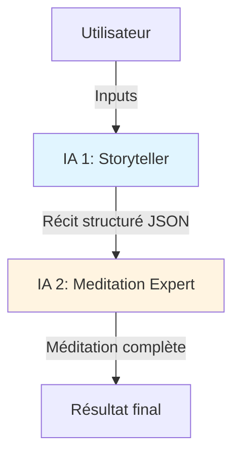
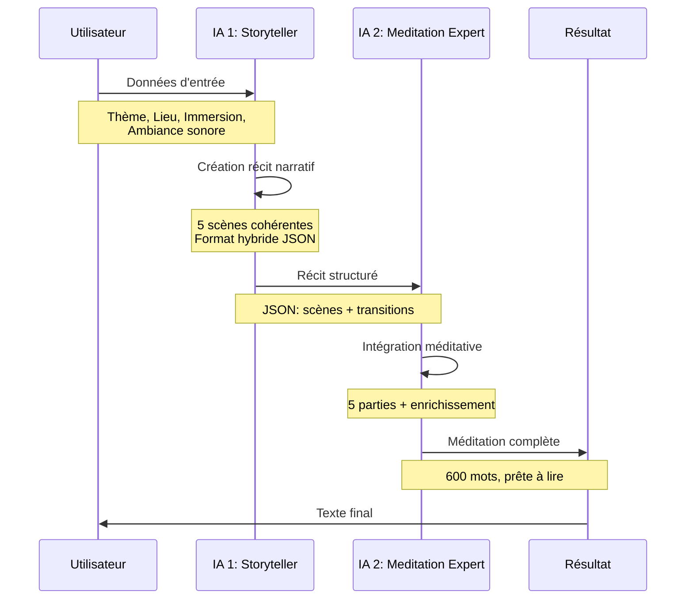
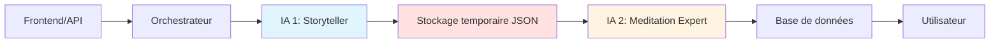

# Architecture Système : Double IA pour Génération de Méditations

## Table des matières
1. [Vue d'ensemble](#vue-densemble)
2. [Analyse du système actuel](#analyse-du-système-actuel)
3. [Architecture proposée](#architecture-proposée)
4. [Flux de données](#flux-de-données)
5. [IA 1 : Storyteller](#ia-1--storyteller)
6. [IA 2 : Meditation Expert](#ia-2--meditation-expert)
7. [Format d'interface entre IA](#format-dinterface-entre-ia)
8. [Exemple de flux complet](#exemple-de-flux-complet)
9. [Considérations d'implémentation](#considérations-dimplémentation)

---

## Vue d'ensemble

### Problème actuel
Le système actuel utilise un seul prompt qui tente de gérer simultanément :
- La création narrative (scènes cohérentes, arc narratif)
- L'aspect méditatif (respiration, relaxation, rythme)

**Résultat** : Des scènes floues et mal liées malgré de bonnes parties relaxantes.

### Solution proposée
Architecture en **deux étapes** avec IA spécialisées opérant en séquence :

1. **IA 1 - Storyteller** : Crée un récit narratif cohérent de 5 scènes
2. **IA 2 - Meditation Expert** : Intègre ce récit dans une structure méditative complète

---

## Analyse du système actuel

### Forces (à conserver)
✅ **Parties 1-3 fonctionnent bien** :
- Invitation initiale apaisante
- Ancrage respiratoire efficace
- Scan corporel bien guidé

### Faiblesses (à résoudre)
❌ **Partie 4 (Visualisation) problématique** :
- **Confusion spatiale** : Mélange entre bibliothèque (présent) et scènes préhistoriques (passé)
- **Scènes mal liées** : Transitions abruptes entre lieux différents
- **Vocabulaire trop technique** : "Mésozoïque", "Crétacé", "Paléontologie" brisent l'immersion
- **Arc narratif faible** : Pas de progression claire entre les scènes

### Diagnostic
Le prompt unique ne peut pas optimiser simultanément :
- La **cohérence narrative** (structure, transitions, progression)
- La **qualité méditative** (rythme, ancrage, relaxation)

---

## Architecture proposée



### Principe de séparation des responsabilités

| Aspect | IA 1 : Storyteller | IA 2 : Meditation Expert |
|--------|-------------------|--------------------------|
| **Focus principal** | Cohérence narrative | Structure méditative |
| **Output** | Récit de 5 scènes (~300 mots) | Méditation complète (~600 mots) |
| **Expertise** | Storytelling visuel | Techniques de relaxation |
| **Connaît la méditation** | Conscience minimale | Expertise complète |

---

## Flux de données

### Schéma détaillé



### Étapes détaillées

1. **Input utilisateur** → IA 1
   - Thème (ex: "Dinosaures")
   - Lieu de méditation (ex: "bibliothèque")
   - Description immersion
   - Ambiance sonore à venir (ex: "Pluie et orage")

2. **IA 1 traite** → Génère récit structuré
   - Crée 5 scènes visuelles cohérentes
   - Assure transitions fluides
   - Vocabulaire simple et sensoriel
   - Format : JSON + prose courte

3. **Récit structuré** → IA 2
   - JSON avec métadonnées de chaque scène
   - Texte narratif court pour chaque scène

4. **IA 2 traite** → Génère méditation complète
   - Intègre récit dans structure 5 parties
   - Ajoute ancrage méditatif
   - Enrichit d'éléments relaxants
   - Transition vers sommeil

5. **Output final** → Utilisateur
   - Texte complet ~600 mots
   - Prêt à être lu/écouté

---

## IA 1 : Storyteller

### Rôle et responsabilités

**Mission principale** : Créer un récit visuel cohérent de 5 scènes progressives.

#### Responsabilités ✅
- ✅ Concevoir un **arc narratif** simple et clair
- ✅ Créer des **transitions fluides** entre scènes
- ✅ Utiliser un **vocabulaire sensoriel** simple (pas de termes techniques)
- ✅ Assurer la **cohérence spatiale** (une progression logique des lieux)
- ✅ Maintenir une **atmosphère apaisante** (contexte relaxant)
- ✅ Respecter le thème et le lieu fournis
- ✅ Fournir des **connexions cohérentes** (lieu/thème/exploration/retour/son)

#### N'est PAS responsable de ❌
- ❌ L'ancrage respiratoire
- ❌ Le scan corporel
- ❌ La structure méditative en 5 parties
- ❌ La transition vers le sommeil
- ❌ Le rythme méditatif (pauses, ralentissement)

### Données d'entrée

L'IA 1 reçoit les données sélectionnées aléatoirement par le système JavaScript depuis [`themeList.json`](data/themeList.json) et [`place.json`](data/place.json).

**Structure réelle des données** :

```json
{
  "theme": {
    "theme": "Dinosaures",
    "universe": "Un monde préhistorique où des reptiles géants, les dinosaures, règnent en maîtres sur la Terre, des plaines luxuriantes aux forêts denses, il y a des millions d'années, avant l'apparition de l'homme.",
    "vocabulary": ["Crétacé", "Jurassique", "Extinction", "Fossile", "Paléontologie", "Mésozoïque", "Prédateur", "Herbivore"]
  },
  "ambiance": {
    "id": "pluie_orage-1",
    "label": "Pluie et orage",
    "description": "Une ambiance apaisante de pluie avec des éclairs et le son lointain du tonnerre.",
    "immersion": {
      "name": "à la bibliothèque",
      "description": "Installé dans un fauteuil en cuir d'une vieille bibliothèque chaleureuse, un livre à la main, écoutant la pluie frapper les hautes fenêtres."
    }
  },
  "user": {
    "name": "Vincent",
    "sleep_duration": "8h56"
  }
}
```

**Notes importantes** :
- Un script JavaScript sélectionne aléatoirement un thème depuis [`themeList.json`](data/themeList.json) (32 thèmes disponibles)
- Le script sélectionne aléatoirement une ambiance depuis [`place.json`](data/place.json)
- Pour chaque ambiance, une immersion est sélectionnée aléatoirement dans `metadata.immersionList`
- Actuellement, seule l'ambiance "pluie_orage-1" contient 7 immersions différentes
- Cette sélection aléatoire assure la diversité des expériences de méditation

### Format de sortie (JSON structuré)

```json
{
  "narrative": {
    "arc": "Du lieu de méditation vers l'univers thématique, puis retour progressif",
    "total_scenes": 5,
    "scenes": [
      {
        "scene_number": 1,
        "title": "Titre court et évocateur",
        "location": "Description du lieu",
        "sensory_elements": {
          "visual": "Ce qu'on voit",
          "auditory": "Ce qu'on entend",
          "tactile": "Ce qu'on ressent",
          "olfactory": "Ce qu'on sent (optionnel)"
        },
        "narrative_text": "Texte narratif court (50-70 mots) en prose, style poétique et sensoriel",
        "transition_to_next": "Comment cette scène mène à la suivante"
      },
      {
        "scene_number": 2,
        "title": "...",
        "location": "...",
        "sensory_elements": { "..." },
        "narrative_text": "...",
        "transition_to_next": "..."
      },
      {
        "scene_number": 3,
        "title": "...",
        "location": "...",
        "sensory_elements": { "..." },
        "narrative_text": "...",
        "transition_to_next": "Retour progressif au lieu de méditation"
      }
    ]
  },
  "metadata": {
    "total_words": 300,
    "atmosphere": "apaisante",
    "spatial_coherence": "linear"
  }
}
```

### Contraintes et règles

#### Contraintes structurelles
- **Nombre de scènes** : 5
- **Longueur totale** : ~300 mots (tous textes narratifs combinés)
- **Longueur par scène** : 30-70 mots de prose
- **Arc narratif** : Ancrage → Exploration → Exploration profonde → Retour → Ancrage final

#### Règles de création

1. **Cohérence spatiale stricte**
   - Chaque scène = un lieu précis
   - Transitions géographiques logiques
   - Éviter les sauts temporels/spatiaux abrupts

2. **Vocabulaire sensoriel simple**
   - ✅ Utiliser : "lumière douce", "bruit de l'eau", "chaleur agréable"
   - ❌ Éviter : termes scientifiques, jargon technique
   - Exception : Peut utiliser 1-2 mots du vocabulaire thématique si essentiels ET simples

3. **Progression narrative**

**Scène 1 - Ancrage** (15%)
- Commence par la découverte du lieu de méditation
- Établit une connexion entre le présent et le récit à venir
- Introduit quelques éléments de l'univers thématique
- Crée une transition douce vers l'univers thématique

**Scène 2 - Exploration** (20%)
- Exploration de l'univers thématique dans les alentours du lieu
- Immersion progressive dans le thème
- Détails sensoriels riches
- ✅ **IMPORTANT** : Établir clairement l'axe/chemin d'exploration pour la suite

**Scène 3 - Exploration profonde** (30%)
- Exploration d'un autre lieu plus éloigné et plus immersif
- Plongée plus profonde dans l'univers thématique
- Intensification des éléments sensoriels
- ✅ **IMPORTANT** : Point culminant du récit (moment fort)

**Scène 4 - Retour** (25%)
- Retour progressif au lieu précédent (scène 2)
- Puis retour progressif au lieu initial (scène 1)
- Intensification du son de l'ambiance
- ✅ **IMPORTANT** : Retour OBLIGATOIRE par les mêmes lieux que l'aller (symétrie)

**Scène 5 - Ancrage final** (10%)
- Renforcement du retour au lieu de méditation
- Dernières images apaisantes
- Remplacement naturel de la méditation par l'ambiance sonore

4. **Atmosphère relaxante**
   - Pas de danger, conflit, ou tension
   - Rythme lent et contemplatif
   - Images apaisantes et sécurisantes
   - Privilégier : observation, contemplation, immersion douce

5. **Éléments sensoriels riches**
   - Au moins 3 sens par scène (vue, ouïe, toucher prioritaires)
   - Détails concrets et visualisables
   - Éviter abstractions et concepts

6. **Lien avec l'ambiance sonore**
   - La dernière scène doit préparer l'arrivée du son
   - Ex: Si "pluie", introduire progressivement l'eau, l'humidité

### Exemples de bonnes vs mauvaises scènes

#### ❌ Mauvais exemple
```
"Scène 1: Le Mésozoïque
Tu te retrouves au Crétacé supérieur, entouré de dinosaures herbivores 
qui broutent des fougères arborescentes. Les ptérosaures planent dans 
le ciel azuré tandis qu'un tyrannosaure rôde à proximité."
```
**Problèmes** :
- Vocabulaire trop technique (Mésozoïque, Crétacé supérieur, ptérosaures)
- Présence de danger (tyrannosaure)
- Pas de lien avec le lieu de méditation initial
- Pas assez d'éléments sensoriels concrets

#### ✅ Bon exemple
```
"Scène 1: Le livre ancien
Dans le fauteuil de cuir, tu tiens un livre illustré. Sur la page, 
une forêt verte s'étend sous un ciel blanc de brume. Des créatures 
géantes au pas lent marchent entre les fougères hautes. Tu entends 
presque le froissement des feuilles, sens l'humidité de l'air. 
Le cuir du fauteuil est chaud sous tes doigts."
```
**Forces** :
- Ancrage dans le lieu de méditation (fauteuil, livre)
- Vocabulaire simple et évocateur
- Éléments sensoriels multiples (vue, ouïe, toucher)
- Atmosphère paisible
- Transition fluide entre présent et visualisation

### Techniques avancées recommandées

Les benchmarks ont identifié plusieurs techniques très efficaces pour améliorer la qualité narrative :

#### 1. Guides narratifs
Utiliser des personnages, objets ou éléments pour fluidifier les transitions :
- **Personnages** : Créatures thématiques qui guident (ex: Pokémon)
- **Éléments naturels** : Sentier, lumière, son, vent
- **Objets** : Carte, Poké Ball, livre

**Avantages :**
- Transitions plus naturelles et fluides
- Cohérence thématique renforcée
- Dimension émotionnelle ajoutée

#### 2. Objet de connexion
Introduire un objet tangible reliant le lieu de méditation au thème :
- Brille/s'active au début (scène 1)
- Disparaît/s'éteint à la fin (scène 5)
- Crée un bouclage narratif satisfaisant

**Exemples :**
- Poké Ball ancienne sur l'appui de fenêtre
- Carte mystérieuse avec symbole thématique
- Livre illustré du thème

#### 3. Axe d'exploration clair
Établir dès la scène 2 un élément spatial constant :
- Sentier, forêt, chemin, rivière
- Même axe pour aller ET retour
- Facilite la compréhension spatiale

**Avantages :**
- Évite les confusions spatiales
- Structure claire et rassurante
- Symétrie narrative naturelle

---

## IA 2 : Meditation Expert

### Rôle et responsabilités

**Mission principale** : Transformer le récit narratif en méditation guidée complète.

#### Responsabilités ✅
- ✅ Structurer la méditation en **5 parties** (invitation, respiration, scan corporel, visualisation, transition sommeil)
- ✅ Intégrer le récit de l'IA 1 dans la partie 4 (visualisation)
- ✅ Ajouter **ancrage respiratoire** (partie 2)
- ✅ Guider **scan corporel** (partie 3)
- ✅ Créer **transition vers le sommeil** (partie 5)
- ✅ Enrichir le texte d'éléments méditatifs :
  - Marques de pause ("...", espaces)
  - Instructions respiratoires intégrées
  - Ralentissement progressif du rythme
  - Vocabulaire apaisant
- ✅ Maintenir cohérence avec le ton et l'ambiance du récit
- ✅ Introduire l'ambiance sonore en partie 5

#### N'est PAS responsable de ❌
- ❌ Créer le récit narratif (déjà fourni par IA 1)
- ❌ Modifier la structure des scènes narratives
- ❌ Changer l'ordre ou le contenu des scènes
- ❌ Ajouter de nouvelles scènes visuelles

### Données d'entrée

Reçoit le JSON de l'IA 1 + données utilisateur originales :

```json
{
  "story": {
    "narrative": { 
      "scenes": [...] 
    },
    "metadata": {...}
  },
  "user_data": {
    "name": "Vincent",
    "sleep_duration": "8h56",
    "ambiance_sonore": {
      "label": "Pluie et orage",
      "description": "..."
    }
  }
}
```

### Format de sortie (Texte final)

Texte en prose naturelle, ~600 mots, structuré en 5 parties fluides sans titres apparents.

**Structure implicite** :
```
[Partie 1 : Invitation - 50-70 mots]
Phrase d'accueil personnalisée + création atmosphère + lever pression temporelle

[Partie 2 : Ancrage respiratoire - 80-100 mots]
3-4 cycles respiratoires guidés + métaphores apaisantes

[Partie 3 : Scan corporel - 100-120 mots]
Progression tête → pieds, détente de chaque zone

[Partie 4 : Visualisation narrative - 250-300 mots]
Intégration des 5 scènes de l'IA 1 avec enrichissements méditatifs

[Partie 5 : Transition sommeil - 80-100 mots]
Introduction ambiance sonore + clôture douce + dernières images apaisantes
```

### Contraintes et règles

#### Contraintes structurelles
- **Longueur totale** : ~600 mots (±50 mots)
- **Format** : Prose fluide, sans titres de sections
- **Ton** : 2e personne du singulier ("tu")
- **Temps** : Présent pour l'immersion
- **Personnalisation** : Utiliser le prénom de l'utilisateur

#### Règles d'intégration narrative

1. **Respect du récit original**
   - NE PAS modifier l'ordre des scènes
   - NE PAS changer les lieux ou éléments clés
   - NE PAS ajouter de nouvelles scènes visuelles
   - Conserver la cohérence spatiale établie par IA 1

2. **Enrichissement méditatif autorisé**
   - ✅ Ajouter des pauses ("...")
   - ✅ Intégrer des instructions respiratoires subtiles
   - ✅ Ralentir progressivement le rythme
   - ✅ Ajouter des sensations de détente corporelle
   - ✅ Utiliser métaphores de relâchement
   - ✅ Enrichir le vocabulaire sensoriel

3. **Transitions entre scènes**
   - Utiliser les `transition_to_next` fournies par IA 1
   - Ajouter éléments de liant (respiration, sensations)
   - Maintenir fluidité narrative

4. **Partie 4 : Intégration des scènes**
   
   Pour chaque scène :
   ```
   [Élément de transition/ancrage]
   + [Texte narratif de la scène]
   + [Enrichissement méditatif]
   + [Transition vers scène suivante]
   ```

5. **Partie 5 : Transition vers sommeil**
   - Introduction naturelle de l'ambiance sonore
   - Lien avec dernière scène narrative
   - Invitation au lâcher-prise
   - Dernières images apaisantes
   - PAS de réveil brutal ou appel à l'action

#### Techniques d'enrichissement méditatif

**Marqueurs de pause** :
- "..." pour pauses courtes
- Espaces entre paragraphes pour pauses longues
- Répétitions apaisantes ("encore... doucement... tranquillement")

**Instructions respiratoires intégrées** :
- ✅ "Tu inspires... tu expires..."
- ✅ "À chaque souffle, tu..."
- ❌ Éviter instructions trop directes : "Inspire maintenant par le nez pendant 4 secondes"

**Ralentissement progressif** :
- Phrases plus courtes en fin de méditation
- Moins de détails visuels, plus de sensations
- Vocabulaire plus simple et répétitif

**Vocabulaire méditatif** :
- Mots doux : "doucement", "tranquillement", "paisiblement"
- Sensations : "lourd", "chaud", "détendu", "léger"
- Métaphores : "comme une vague", "tel un souffle"

### Exemple de transformation

#### Input (Scène IA 1)
```json
{
  "scene_number": 1,
  "narrative_text": "Dans le fauteuil de cuir, tu tiens un livre illustré. 
  Sur la page, une forêt verte s'étend sous un ciel blanc de brume. 
  Des créatures géantes au pas lent marchent entre les fougères hautes."
}
```

#### Output (Version enrichie IA 2)
```
Te voilà dans le fauteuil... le cuir est chaud sous tes mains... 
tu tiens un livre ancien, et sur la page, une forêt verte respire 
doucement sous un ciel de brume... Tu inspires avec elle... expires 
avec elle... Des créatures géantes marchent entre les fougères, 
leur pas est si lent qu'il devient le rythme même de ta respiration... 
chaque pas... un souffle... chaque souffle... une détente plus profonde...
```

**Enrichissements ajoutés** :
- Pauses ("...")
- Lien respiratoire ("tu inspires avec elle")
- Métaphore méditative ("leur pas devient le rythme de ta respiration")
- Ralentissement ("chaque pas... un souffle...")

---

## Format d'interface entre IA

### Schéma de communication

```
IA 1 (Storyteller) --[JSON]→ IA 2 (Meditation Expert)
```

### Structure JSON complète

```json
{
  "version": "1.0",
  "storyteller_output": {
    "narrative": {
      "arc_description": "Description brève de l'arc narratif global",
      "total_scenes": 5,
      "scenes": [
        {
          "scene_number": 1,
          "title": "Titre évocateur court",
          "location": "Description précise du lieu",
          "atmosphere": "Qualificatif ambiance (calme, paisible, etc.)",
          "sensory_elements": {
            "visual": "Éléments visuels dominants",
            "auditory": "Sons présents",
            "tactile": "Sensations tactiles",
            "olfactory": "Odeurs (optionnel)",
            "temperature": "Sensations thermiques (optionnel)"
          },
          "narrative_text": "Texte narratif en prose (50-70 mots), style poétique, temps présent, 2e personne",
          "meditation_hints": {
            "breathing_anchor": "Élément de la scène pouvant servir d'ancrage respiratoire",
            "relaxation_focus": "Aspect à utiliser pour détente"
          },
          "transition_to_next": "Description de comment cette scène mène naturellement à la suivante"
        }
      ]
    },
    "metadata": {
      "total_narrative_words": 300,
      "atmosphere_tags": ["paisible", "contemplatif", "sécurisant"],
      "dominant_senses": ["visual", "auditory", "tactile"],
      "spatial_coherence": "linear|circular|stationary",
      "connection_to_sound": "Comment le récit prépare l'ambiance sonore finale"
    }
  },
  "original_context": {
    "theme": "Dinosaures",
    "meditation_location": "bibliothèque",
    "sound_ambiance": "Pluie et orage",
    "user_name": "Vincent"
  }
}
```

### Spécifications des champs

#### Champs obligatoires ⭐
- `scene_number` ⭐
- `location` ⭐
- `narrative_text` ⭐
- `transition_to_next` ⭐
- `sensory_elements.visual` ⭐
- `sensory_elements.auditory` ⭐

#### Champs optionnels
- `title` (aide l'IA 2 à comprendre le focus de la scène)
- `atmosphere` (guide le ton à maintenir)
- `meditation_hints` (suggestions pour enrichissement méditatif)
- `sensory_elements.olfactory` (bonus sensoriel)
- `sensory_elements.temperature` (bonus sensoriel)

#### Champs de métadonnées
- `total_narrative_words` : Compte des mots totaux
- `atmosphere_tags` : Tags d'ambiance pour cohérence
- `dominant_senses` : Sens les plus utilisés
- `spatial_coherence` : Type de progression spatiale
- `connection_to_sound` : Lien avec ambiance sonore finale

### Validation et contrôle qualité

#### Validation technique
- ✅ Format JSON valide
- ✅ Tous les champs obligatoires présents
- ✅ 5 scènes exactement
- ✅ Longueur totale 270-330 mots
- ✅ Longueur par scène 20-80 mots

#### Validation qualité narrative
- ✅ Cohérence spatiale : Retour symétrique obligatoire
- ✅ Aucun élément de danger ou tension
- ✅ Vocabulaire simple et sensoriel
- ✅ Au minimum 3 sens par scène
- ✅ Transitions fluides (2-3 phrases minimum)

#### Seuils de qualité minimale
Pour être utilisable en production :
- Note globale ≥ 40/50 (voir guide d'évaluation)
- Cohérence spatiale ≥ 8/10
- Aucun problème critique (retour non symétrique, danger, etc.)

---

## Exemple de flux complet

### Étape 1 : Données utilisateur (Input)

```json
{
  "user": {
    "name": "Vincent",
    "sleep_duration": "8h56"
  },
  "meditation_config": {
    "theme": {
      "label": "Forêt enchantée",
      "description": "Une forêt mystérieuse où la nature semble vivante et bienveillante",
      "vocabulary": ["feuillage", "clairière", "lumière filtrée", "mousse", "ruisseau"]
    },
    "location": {
      "name": "cabane en bois",
      "immersion_description": "Assis dans une cabane douillette en bois, près d'un poêle qui crépite, regardant la forêt par la fenêtre"
    },
    "sound_ambiance": {
      "label": "Pluie douce",
      "description": "Une pluie légère et régulière qui tambourine sur les feuilles"
    }
  }
}
```

### Étape 2 : Output IA 1 (Storyteller)

```json
{
  "version": "1.0",
  "storyteller_output": {
    "narrative": {
      "arc_description": "De la cabane chaleureuse vers la forêt proche, puis retour progressif",
      "total_scenes": 5,
      "scenes": [
        {
          "scene_number": 1,
          "title": "La fenêtre de la cabane",
          "location": "Intérieur de la cabane, devant la fenêtre",
          "atmosphere": "chaleureux et protégé",
          "sensory_elements": {
            "visual": "Forêt verte à travers la fenêtre, lumière douce du poêle",
            "auditory": "Crépitement du feu, silence profond dehors",
            "tactile": "Chaleur du poêle, douceur du bois sous les doigts",
            "olfactory": "Bois brûlé, senteur de résine"
          },
          "narrative_text": "Tu es assis près de la fenêtre de la cabane. Le poêle crépite doucement derrière toi, diffusant une chaleur agréable. À travers les carreaux, la forêt s'étend, verte et tranquille. La lumière du jour filtre entre les branches, créant des motifs mouvants sur le sol de mousse. Tes mains reposent sur le bois chaud du rebord.",
          "meditation_hints": {
            "breathing_anchor": "Le crépitement régulier du feu",
            "relaxation_focus": "La chaleur enveloppante du poêle"
          },
          "transition_to_next": "Ton regard se pose sur un sentier visible depuis la fenêtre"
        },
        {
          "scene_number": 2,
          "title": "Le sentier de mousse",
          "location": "Sentier forestier proche de la cabane",
          "atmosphere": "paisible et immersif",
          "sensory_elements": {
            "visual": "Sentier de mousse verte, rayons de lumière entre feuilles",
            "auditory": "Bruissement léger des feuilles, chant lointain d'oiseau",
            "tactile": "Mousse douce sous les pieds, air frais sur la peau",
            "temperature": "Fraîcheur légère mais agréable"
          },
          "narrative_text": "Tu imagines suivre ce sentier couvert de mousse épaisse et verte. Chaque pas est silencieux, amorti. Les arbres forment une voûte au-dessus de toi, laissant passer des rayons de lumière dorée qui dansent sur le sol. Tu entends le bruissement doux des feuilles, le chant lointain d'un oiseau. L'air est frais et sent la terre humide et les feuilles.",
          "meditation_hints": {
            "breathing_anchor": "Le rythme lent de la marche imaginée",
            "relaxation_focus": "La douceur de la mousse sous les pieds"
          },
          "transition_to_next": "Le sentier mène à une petite clairière avec un ruisseau"
        },
        {
          "scene_number": 3,
          "title": "La clairière au ruisseau",
          "location": "Clairière forestière avec ruisseau",
          "atmosphere": "serein et contemplatif",
          "sensory_elements": {
            "visual": "Clairière lumineuse, ruisseau clair qui coule",
            "auditory": "Murmure de l'eau sur les pierres",
            "tactile": "Herbe tendre, fraîcheur de l'eau à proximité",
            "temperature": "Douceur tempérée"
          },
          "narrative_text": "Tu arrives dans une clairière où un ruisseau coule doucement. L'eau glisse sur les pierres lisses avec un murmure constant et apaisant. Tu t'assois sur l'herbe tendre au bord du ruisseau. La lumière est plus vive ici, mais douce. L'eau claire reflète le ciel et les arbres. Tu poses ta main dans l'eau fraîche, sens le courant léger.",
          "meditation_hints": {
            "breathing_anchor": "Le murmure continu de l'eau",
            "relaxation_focus": "Le flux apaisant du ruisseau"
          },
          "transition_to_next": "Tu sens que le ciel commence à se couvrir légèrement, promesse de pluie douce. Tu retournes vers la cabane"
        }
      ]
    },
    "metadata": {
      "total_narrative_words": 198,
      "atmosphere_tags": ["paisible", "contemplatif", "sécurisant", "naturel"],
      "dominant_senses": ["visual", "auditory", "tactile"],
      "spatial_coherence": "circular",
      "connection_to_sound": "La scène finale introduit le ruisseau qui prépare le son de la pluie, et annonce le ciel qui se couvre"
    }
  },
  "original_context": {
    "theme": "Forêt enchantée",
    "meditation_location": "cabane en bois",
    "sound_ambiance": "Pluie douce",
    "user_name": "Vincent"
  }
}
```

### Étape 3 : Output IA 2 (Meditation Expert) - Méditation finale

```
Bonsoir Vincent... Ce soir, tu t'abandonnes à une forêt enchantée, 
paisible et vivante... un lieu où la nature elle-même veille sur toi. 
Tu n'as rien à faire... rien à prouver... la nuit est longue, 
et elle t'accueille avec douceur.

Inspire lentement par le nez... laisse l'air remplir tranquillement 
ta poitrine... expire doucement par la bouche, comme un souffle qui 
dépose le jour derrière toi. Encore... inspire... puis relâche... 
À chaque expiration, un poids se détache... tu deviens plus léger... 
plus présent... Le rythme s'apaise, comme une vague qui rentre 
lentement sur le rivage.

Tu portes maintenant ton attention sur ton front... il se détend... 
Les yeux se reposent derrière les paupières, paisibles. La mâchoire 
se relâche... la langue repose doucement. La nuque s'adoucit... 
les épaules descendent, comme si un poids glissait de chaque côté. 
Les bras deviennent lourds... agréablement lourds. La poitrine s'ouvre 
tranquillement... le ventre suit le rythme doux de ta respiration. 
Le bas du dos reçoit le soutien, il se détend... Les hanches 
s'alourdissent, en sécurité. Les cuisses relâchent leur poids... 
les genoux... les mollets... jusqu'aux pieds qui se reposent 
complètement. Tout ton corps s'installe... présent... apaisé.

Tu es assis près de la fenêtre de la cabane... Le poêle crépite 
doucement derrière toi... ce son régulier devient comme ta respiration... 
crépitement... inspiration... crépitement... expiration... Une chaleur 
agréable se diffuse dans ton dos, sur tes épaules... À travers les 
carreaux de la fenêtre, la forêt s'étend, verte et tranquille... 
La lumière du jour filtre entre les branches, créant des motifs 
mouvants sur le sol de mousse... comme des vagues de lumière qui 
bercent la forêt... Tes mains reposent sur le bois chaud du rebord... 
le grain du bois est doux sous tes doigts...

Ton regard se pose sur un sentier... un sentier de mousse verte 
qui s'enfonce doucement dans la forêt... Tu l'imagines sous tes pieds... 
chaque pas serait si doux... si silencieux... La mousse épaisse amortit 
tout... comme si tu marchais sur un nuage vert... Les arbres forment 
une voûte protectrice au-dessus de toi... des rayons de lumière dorée 
glissent entre les feuilles... dansent lentement sur le sol... 
Tu entends le bruissement doux des feuilles... un murmure constant... 
un chant lointain d'oiseau... L'air est frais... il sent la terre 
humide et les feuilles... À chaque pas imaginaire, tu t'enfonces 
un peu plus dans la détente... un peu plus dans le calme...

Le sentier te mène vers une clairière... une ouverture lumineuse 
dans la forêt... Là, un ruisseau coule doucement... l'eau glisse 
sur les pierres lisses avec un murmure si apaisant... ce murmure 
devient le rythme de ta respiration... l'eau coule... tu expires... 
l'eau continue... tu inspires... Tu t'assois sur l'herbe tendre 
au bord du ruisseau... La lumière est plus vive ici, mais si douce... 
L'eau claire reflète le ciel et les arbres... comme un miroir vivant... 
Tu poses ta main dans l'eau fraîche... sens le courant léger qui 
caresse ta peau... cette fraîcheur apaisante...

Le ciel au-dessus de la clairière commence à se couvrir légèrement... 
des nuages doux passent... promesse d'une pluie délicate... Tu sens 
que c'est le moment de retourner vers la cabane... Le sentier t'attend... 
la mousse est toujours aussi douce... les arbres te saluent doucement... 
Et bientôt, tu es de nouveau près de la fenêtre chaude... le poêle 
crépite toujours... mais maintenant, tu entends aussi... les premières 
gouttes de pluie... elles commencent à tomber sur les feuilles de la 
forêt... un tambourinement léger... régulier... apaisant...

La pluie douce prend maintenant le relais... elle tambourine
tendrement sur les feuilles... sur le toit de la cabane... une berceuse
naturelle qui t'enveloppe complètement... Tu es en sécurité... au chaud...
bercé par cette musique de la nature... Tes pensées se font rares...
légères... comme des feuilles qui flottent sur le ruisseau...
Une dernière image de la forêt paisible... le sentier de mousse qui
t'attend demain... et tu glisses doucement... en toute confiance...
vers le sommeil.
```

**Analyse de l'exemple** :
- ✅ Structure en 5 parties respectée
- ✅ Récit narratif intégré fidèlement (scènes 1, 2, 3)
- ✅ Enrichissements méditatifs ajoutés (pauses, respiration, ralentissement)
- ✅ Transitions fluides entre scènes
- ✅ Introduction naturelle de la pluie en partie 5
- ✅ ~620 mots (dans la cible de 600 ±50)

---

## Considérations d'implémentation

### Architecture technique recommandée



### Composants du système

#### 1. Orchestrateur (Backend)
**Responsabilités** :
- Recevoir les paramètres utilisateur
- Sélectionner aléatoirement thème et ambiance depuis les JSON
- Appeler l'IA 1 avec les données formatées
- Valider l'output de l'IA 1
- Passer le résultat à l'IA 2
- Gérer les erreurs et retry logic
- Stocker le résultat final

**Technologies suggérées** :
- Node.js / Python
- Framework : Express / FastAPI
- Validation : Zod / Pydantic

#### 2. Stockage des configurations
**Fichiers JSON** :
- [`themeList.json`](data/themeList.json) : Liste des thèmes (32 actuellement)
- [`place.json`](data/place.json) : Liste des ambiances et immersions

**Structure recommandée** :
```
/config
  /themes
    themeList.json
  /places
    place.json
```

#### 3. Gestion des prompts IA

**Prompt IA 1 (Storyteller)** :
```
Tu es un créateur d'histoires visuelles pour méditation.

MISSION: Créer un récit narratif de 5 scènes cohérentes et apaisantes.

DONNÉES D'ENTRÉE:
- Thème: {theme.theme}
- Univers: {theme.universe}
- Vocabulaire disponible: {theme.vocabulary}
- Lieu de méditation: {ambiance.immersion.name}
- Description immersion: {ambiance.immersion.description}
- Ambiance sonore finale: {ambiance.label}

CONTRAINTES:
- 5 scènes exactement
- ~300 mots au total
- 30-70 mots par scène
- Vocabulaire simple et sensoriel
- Arc narratif: Ancrage → Exploration → Exploration profonde → Retour → Ancrage final
- Atmosphère relaxante uniquement

FORMAT DE SORTIE: JSON (voir structure complète dans documentation)
```

**Prompt IA 2 (Meditation Expert)** :
```
Tu es un expert en méditation guidée pour le sommeil.

MISSION: Transformer le récit narratif en méditation complète de 5 parties.

DONNÉES D'ENTRÉE:
- Récit narratif: {storyteller_output}
- Nom utilisateur: {user.name}
- Ambiance sonore: {ambiance.label}

STRUCTURE OBLIGATOIRE:
1. Invitation (50-70 mots)
2. Ancrage respiratoire (80-100 mots)
3. Scan corporel (100-120 mots)
4. Visualisation narrative (250-300 mots) - intégrer le récit IA 1
5. Transition sommeil (80-100 mots)

CONTRAINTES:
- ~600 mots total
- Prose fluide, sans titres
- Respecter l'ordre des scènes
- Ne pas modifier le contenu narratif
- Enrichir d'éléments méditatifs

FORMAT DE SORTIE: Texte en prose naturelle
```

### Flux d'implémentation

```javascript
// Pseudo-code de l'orchestrateur
async function generateMeditation(userId) {
  // 1. Sélection aléatoire
  const theme = selectRandomTheme(themeList);
  const ambiance = selectRandomAmbiance(placeList);
  const immersion = selectRandomImmersion(ambiance.metadata.immersionList);
  
  // 2. Préparation input IA 1
  const ai1Input = {
    theme: theme,
    ambiance: {
      id: ambiance.id,
      label: ambiance.metadata.label,
      description: ambiance.metadata.description,
      immersion: immersion
    },
    user: getUserData(userId)
  };
  
  // 3. Appel IA 1 (Storyteller)
  const storyOutput = await callAI1(ai1Input);
  
  // 4. Validation output IA 1
  if (!validateStoryOutput(storyOutput)) {
    throw new Error("Invalid story structure");
  }
  
  // 5. Préparation input IA 2
  const ai2Input = {
    story: storyOutput,
    user_data: {
      name: ai1Input.user.name,
      sleep_duration: ai1Input.user.sleep_duration,
      ambiance_sonore: {
        label: ambiance.metadata.label,
        description: ambiance.metadata.description
      }
    }
  };
  
  // 6. Appel IA 2 (Meditation Expert)
  const meditationText = await callAI2(ai2Input);
  
  // 7. Sauvegarde
  await saveMeditation({
    userId,
    theme: theme.theme,
    ambiance: ambiance.metadata.label,
    immersion: immersion.name,
    storyJson: storyOutput,
    meditationText: meditationText,
    createdAt: new Date()
  });
  
  return meditationText;
}
```

### Validation et qualité

#### Validation output IA 1
```javascript
function validateStoryOutput(output) {
  const checks = [
    output.narrative?.scenes?.length === 5,
    output.metadata?.total_narrative_words >= 270,
    output.metadata?.total_narrative_words <= 330,
    output.narrative.scenes.every(s =>
      s.scene_number &&
      s.location &&
      s.narrative_text &&
      s.transition_to_next &&
      s.sensory_elements?.visual &&
      s.sensory_elements?.auditory
    )
  ];
  
  return checks.every(check => check === true);
}
```

#### Validation output IA 2
```javascript
function validateMeditationOutput(text) {
  const wordCount = text.split(/\s+/).length;
  return wordCount >= 550 && wordCount <= 650;
}
```

### Gestion des erreurs

**Retry logic pour IA 1** :
- Si validation échoue : retry avec prompt plus strict
- Max 3 tentatives
- Logging des échecs pour amélioration

**Retry logic pour IA 2** :
- Si longueur incorrecte : demander ajustement
- Si structure non respectée : regénérer

### Monitoring et métriques

**Métriques à suivre** :
- Temps de génération moyen (IA 1 + IA 2)
- Taux de succès validation
- Distribution des thèmes/ambiances utilisés
- Satisfaction utilisateur (feedback)

**KPIs de qualité** :
- Cohérence narrative (validation manuelle échantillon)
- Respect des contraintes (validation automatique)
- Diversité des méditations générées

### Optimisations futures

1. **Cache intelligent**
   - Pré-générer des récits IA 1 pour combinaisons populaires
   - Réduire latence de génération

2. **Personnalisation avancée**
   - Historique utilisateur (thèmes préférés)
   - Durée de méditation personnalisable
   - Style narratif (plus/moins descriptif)

3. **A/B Testing**
   - Tester différentes structures narratives
   - Optimiser longueur des parties
   - Affiner vocabulaire méditatif

4. **Expansion du contenu**
   - Compléter les immersions manquantes dans [`place.json`](data/place.json)
   - Ajouter nouveaux thèmes dans [`themeList.json`](data/themeList.json)
   - Créer variantes d'ambiances sonores

### Sécurité et conformité

- **Validation des inputs** : Sanitize tous les inputs utilisateur
- **Rate limiting** : Limiter appels API pour éviter abus
- **Stockage sécurisé** : Chiffrement des données personnelles
- **RGPD** : Consentement utilisateur, droit à l'oubli

---

## Ressources d'Évaluation

Pour l'évaluation qualitative des sorties Storyteller, consulter :
- [`analyse/guide_evaluation_storyteller.md`](analyse/guide_evaluation_storyteller.md) : Méthodologie complète d'évaluation
- [`analyse/benchmark_storyteller_qualite_narrative.md`](analyse/benchmark_storyteller_qualite_narrative.md) : Exemple d'analyse comparative

Ces documents fournissent :
- Grille de notation standardisée (50 points)
- Critères détaillés avec barèmes
- Méthodologie reproductible
- Exemples concrets de benchmarks réels

---

## Résumé et recommandations

### Points clés de l'architecture

1. ✅ **Séparation claire des responsabilités** entre IA 1 (narratif) et IA 2 (méditatif)
2. ✅ **Format d'interface structuré** (JSON) pour communication fiable
3. ✅ **Validation à chaque étape** pour garantir la qualité
4. ✅ **Flexibilité** grâce à la sélection aléatoire thème/ambiance
5. ✅ **Évolutivité** avec possibilité d'ajouter thèmes et immersions

### Avantages par rapport au système actuel

| Aspect | Système actuel | Nouvelle architecture |
|--------|---------------|----------------------|
| **Cohérence narrative** | ❌ Scènes mal liées | ✅ Arc narratif clair |
| **Vocabulaire** | ❌ Trop technique | ✅ Simple et sensoriel |
| **Structure méditative** | ⚠️ Parties 1-3 OK, 4-5 faibles | ✅ 5 parties optimisées |
| **Transitions** | ❌ Abruptes | ✅ Fluides et logiques |
| **Maintenance** | ❌ Prompt monolithique | ✅ Composants modulaires |

### Prochaines étapes recommandées

1. **Phase 1 : Développement**
   - [ ] Implémenter l'orchestrateur
   - [ ] Créer les prompts IA 1 et IA 2
   - [ ] Développer la logique de validation
   - [ ] Tester avec exemples

2. **Phase 2 : Tests**
   - [ ] Générer 50 méditations test
   - [ ] Validation manuelle de la qualité
   - [ ] Ajuster prompts si nécessaire
   - [ ] Optimiser paramètres

3. **Phase 3 : Déploiement**
   - [ ] Tests A/B avec utilisateurs
   - [ ] Collecter feedback
   - [ ] Itérer sur les prompts
   - [ ] Monitoring des métriques

4. **Phase 4 : Expansion**
   - [ ] Compléter immersions manquantes
   - [ ] Ajouter nouveaux thèmes
   - [ ] Implémenter personnalisation
   - [ ] Développer variantes

### Conclusion

Cette architecture à double IA résout les problèmes identifiés du système actuel en :
- Séparant les préoccupations narratives et méditatives
- Garantissant la cohérence spatiale et temporelle
- Simplifiant le vocabulaire
- Améliorant les transitions
- Facilitant la maintenance et l'évolution

L'implémentation progressive permet de valider chaque composant avant le déploiement complet, minimisant les risques tout en maximisant la qualité de l'expérience utilisateur.
