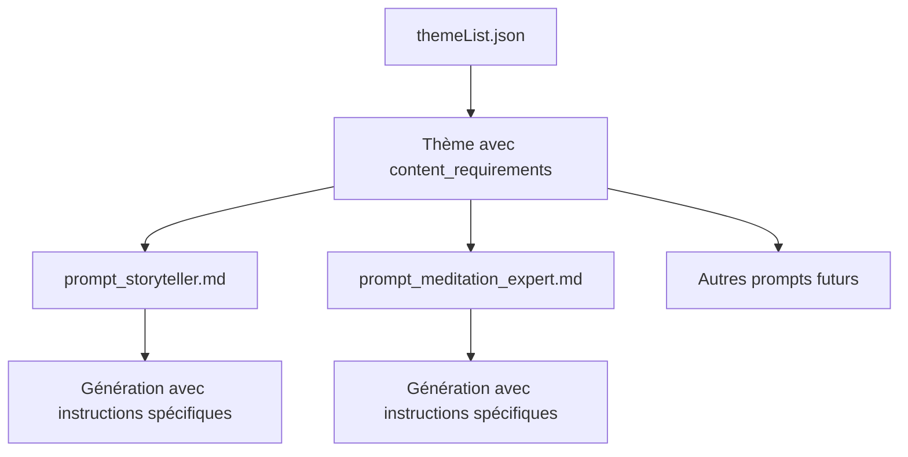

# Solutions pour ajouter des instructions spécifiques par thème

## 📋 Analyse du besoin

### Objectif
Ajouter des instructions spécifiques pour certains thèmes (ex: Pokémon → inclure des noms de Pokémon) qui :
- ✅ Sont réutilisables dans TOUS les prompts (storyteller, meditation expert, etc.)
- ✅ Ne s'appliquent QUE au thème concerné
- ✅ Gardent les thèmes génériques (non liés à la méditation)
- ✅ Sont faciles à maintenir et étendre

### Contraintes
- Plus de 20 thèmes différents
- Base de données et prompts modifiables
- Instructions doivent être génériques

---

## 🎯 Solution recommandée : Champ "content_requirements"

### Architecture



### Modification de la structure JSON

**Avant :**
```json
{
  "theme": "Pokémon",
  "universe": "Un monde où les humains coexistent...",
  "vocabulary": ["Dresseur", "Pokémon", "Poké Ball"]
}
```

**Après :**
```json
{
  "theme": "Pokémon",
  "universe": "Un monde où les humains coexistent...",
  "vocabulary": ["Dresseur", "Pokémon", "Poké Ball", "Attaque", "Capture"],
  "content_requirements": {
    "mandatory_elements": [
      "Inclure des noms de Pokémon spécifiques (ex: Pikachu, Mew, Évoli, Dracaufeu)",
      "Mentionner au moins 2-3 Pokémon différents dans le récit"
    ],
    "examples": [
      "Pikachu", "Mew", "Évoli", "Dracaufeu", "Bulbizarre", "Carapuce",
      "Salamèche", "Ronflex", "Mewtwo", "Celebi", "Lugia"
    ],
    "style_guidelines": [
      "Utiliser les noms originaux des Pokémon (pas de génériques comme 'créature électrique')",
      "Privilégier les Pokémon paisibles et mignons pour l'ambiance relaxante"
    ]
  }
}
```

### Avantages de cette solution

✅ **Modulable** : Chaque thème peut avoir ses propres requirements ou aucun
✅ **Réutilisable** : Les instructions sont accessibles dans tous les prompts
✅ **Extensible** : Facile d'ajouter de nouveaux types d'instructions
✅ **Maintenable** : Centralisé dans un seul fichier
✅ **Flexible** : Peut contenir des listes, des exemples, des règles

---

## 📝 Exemples pour différents thèmes

### Exemple 1 : Pokémon
```json
{
  "theme": "Pokémon",
  "universe": "Un monde où les humains coexistent avec des créatures aux pouvoirs extraordinaires, les Pokémon. Les dresseurs voyagent, capturent, entraînent et combattent aux côtés de leurs Pokémon pour devenir les meilleurs.",
  "vocabulary": ["Dresseur", "Pokémon", "Poké Ball", "Attaque", "Capture", "Évolution", "Arène", "Légendaire"],
  "content_requirements": {
    "mandatory_elements": [
      "Inclure des noms de Pokémon spécifiques",
      "Mentionner au moins 2-3 Pokémon différents"
    ],
    "examples": [
      "Pikachu", "Mew", "Évoli", "Dracaufeu", "Bulbizarre", "Carapuce",
      "Salamèche", "Ronflex", "Mewtwo", "Celebi", "Lugia", "Artikodin"
    ],
    "style_guidelines": [
      "Privilégier les Pokémon paisibles (Évoli, Mew, Ronflex) pour l'ambiance relaxante",
      "Éviter les Pokémon agressifs ou de combat intense"
    ]
  }
}
```

### Exemple 2 : The Last of Us
```json
{
  "theme": "The Last of Us",
  "universe": "Dans un monde post-apocalyptique ravagé par une pandémie causée par un champignon mutant, l'humanité lutte pour sa survie. L'histoire suit des survivants dans leur quête de sécurité et de sens, confrontés à des infectés terrifiants et à la brutalité des autres humains.",
  "vocabulary": ["Cordyceps", "Infectés", "Survivants", "Zone de quarantaine", "Lucioles", "Chasseurs", "Boston", "Élie", "Joel"],
  "content_requirements": {
    "mandatory_elements": [
      "Inclure des noms de personnages (Joel, Ellie)",
      "Mentionner des lieux spécifiques (Boston, Jackson)"
    ],
    "examples": [
      "Joel", "Ellie", "Tommy", "Tess", "Bill", "Boston", "Jackson", "Salt Lake City"
    ],
    "style_guidelines": [
      "Adapter le ton pour la méditation : focus sur l'espoir et la survie, pas la violence",
      "Privilégier les moments calmes et contemplatifs de l'univers"
    ]
  }
}
```

### Exemple 3 : Harry Potter
```json
{
  "theme": "Harry Potter",
  "universe": "Un monde de sorciers, de magie, d'aventures et de mystères, où un jeune orphelin découvre ses pouvoirs et affronte les forces du mal.",
  "vocabulary": ["Poudlard", "sorcier", "moldus", "sortilège", "baguette magique", "potion", "elfe de maison", "Quidditch"],
  "content_requirements": {
    "mandatory_elements": [
      "Inclure des noms de personnages (Harry, Hermione, Ron)",
      "Mentionner des lieux emblématiques (Poudlard, Chemin de Traverse)",
      "Référencer des objets magiques spécifiques"
    ],
    "examples": [
      "Harry Potter", "Hermione Granger", "Ron Weasley", "Albus Dumbledore",
      "Poudlard", "Salle commune", "Grande Salle", "Chemin de Traverse",
      "Choixpeau", "Patronus", "Vif d'or", "Balai volant"
    ],
    "style_guidelines": [
      "Privilégier les moments magiques paisibles",
      "Focus sur la découverte et l'émerveillement plutôt que le danger"
    ]
  }
}
```

### Exemple 4 : Thème sans requirements spécifiques
```json
{
  "theme": "Philosophie",
  "universe": "L'univers philosophique explore les questions fondamentales de l'existence, de la connaissance, des valeurs, de la raison, de l'esprit et du langage.",
  "vocabulary": ["Métaphysique", "Épistémologie", "Éthique", "Logique", "Esthétique", "Ontologie", "Phénoménologie", "Existentialisme"]
  // Pas de content_requirements : les instructions du prompt suffisent
}
```

---

## 🔧 Modifications des prompts

### Dans prompt_storyteller.md

**Ajouter après la ligne 14 (vocabulaire thématique) :**

```markdown
{{#if $('data').item.json.theme.content_requirements }}
### Instructions spécifiques pour ce thème

**Éléments obligatoires** :
{{#each $('data').item.json.theme.content_requirements.mandatory_elements }}
- {{ this }}
{{/each}}

{{#if $('data').item.json.theme.content_requirements.examples }}
**Exemples recommandés** : {{ $('data').item.json.theme.content_requirements.examples.join(", ") }}
{{/if}}

{{#if $('data').item.json.theme.content_requirements.style_guidelines }}
**Directives de style** :
{{#each $('data').item.json.theme.content_requirements.style_guidelines }}
- {{ this }}
{{/each}}
{{/if}}
{{/if}}
```

**Alternative plus simple (si le système de template ne supporte pas les conditions) :**

```markdown
### Instructions spécifiques pour ce thème (si disponibles)
- **Éléments obligatoires** : {{ $('data').item.json.theme.content_requirements.mandatory_elements.join('; ') || 'Aucune instruction spécifique' }}
- **Exemples recommandés** : {{ $('data').item.json.theme.content_requirements.examples.join(', ') || 'Utiliser le vocabulaire thématique général' }}
- **Directives de style** : {{ $('data').item.json.theme.content_requirements.style_guidelines.join('; ') || 'Suivre les directives générales' }}
```

### Dans prompt_meditation_expert.md

**Même ajout après la ligne 14.**

---

## 🎨 Variante : Structure simplifiée

Si la structure complète est trop complexe, voici une version simplifiée :

```json
{
  "theme": "Pokémon",
  "universe": "...",
  "vocabulary": ["Dresseur", "Pokémon", "Poké Ball"],
  "specific_instructions": "Inclure des noms de Pokémon spécifiques (ex: Pikachu, Mew, Évoli, Dracaufeu). Mentionner au moins 2-3 Pokémon différents. Privilégier les Pokémon paisibles pour l'ambiance relaxante.",
  "examples": ["Pikachu", "Mew", "Évoli", "Dracaufeu", "Ronflex"]
}
```

**Dans les prompts :**
```markdown
{{#if $('data').item.json.theme.specific_instructions }}
### Instructions spécifiques pour ce thème
{{ $('data').item.json.theme.specific_instructions }}

**Exemples** : {{ $('data').item.json.theme.examples.join(', ') }}
{{/if}}
```

---

## 📊 Comparaison des solutions

| Critère | content_requirements (recommandé) | specific_instructions (simplifié) |
|---------|-----------------------------------|-----------------------------------|
| Flexibilité | ⭐⭐⭐⭐⭐ | ⭐⭐⭐ |
| Maintenabilité | ⭐⭐⭐⭐⭐ | ⭐⭐⭐⭐ |
| Facilité de mise en place | ⭐⭐⭐ | ⭐⭐⭐⭐⭐ |
| Extensibilité | ⭐⭐⭐⭐⭐ | ⭐⭐⭐ |
| Lisibilité | ⭐⭐⭐⭐ | ⭐⭐⭐⭐⭐ |

---

## 🚀 Plan de mise en œuvre

### Phase 1 : Mise à jour de la base de données
1. Ajouter le champ `content_requirements` aux thèmes concernés dans `themeList.json`
2. Commencer par 3-5 thèmes pilotes (Pokémon, Harry Potter, The Last of Us, Star Wars)
3. Tester avec différents scénarios

### Phase 2 : Mise à jour des prompts
1. Modifier `prompt_storyteller.md` pour intégrer les instructions
2. Modifier `prompt_meditation_expert.md` de la même façon
3. Tester les générations avec et sans `content_requirements`

### Phase 3 : Déploiement progressif
1. Enrichir les autres thèmes selon les besoins
2. Documenter les bonnes pratiques
3. Créer un template pour faciliter l'ajout de nouveaux thèmes

### Phase 4 : Optimisation
1. Analyser les résultats
2. Ajuster les instructions si nécessaire
3. Enrichir avec de nouveaux types d'instructions si besoin

---

## ✅ Checklist de validation

- [ ] Le champ `content_requirements` est optionnel (thèmes sans requirements fonctionnent)
- [ ] Les instructions sont génériques (pas spécifiques à la méditation)
- [ ] Les exemples sont pertinents pour le thème
- [ ] Les instructions ne s'appliquent QU'au thème concerné
- [ ] Les prompts affichent correctement les instructions
- [ ] La génération utilise bien les instructions
- [ ] Facile d'ajouter un nouveau thème avec requirements
